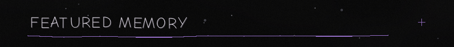
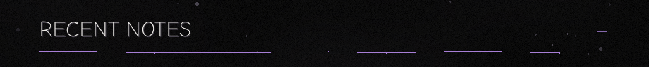
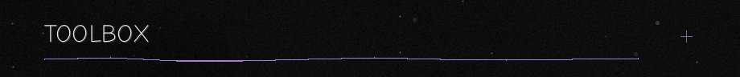
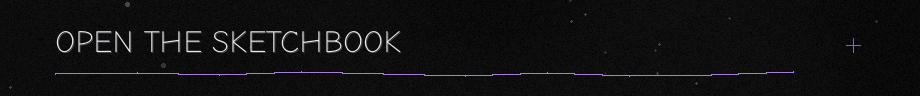

<!--
Planton361 profile README — lively dark album version.

The four featured repositories are currently private.
Review every visible project note before publishing.
-->

  

  

 

  

<table>
<tr>
<td width="62%" align="center" valign="top">

</td>
<td width="38%" valign="middle">

FEATURED MEMORY / 01

<h3>Life OS</h3>

A personal planning and second-brain application created to reduce decision overload across study, work and personal projects.

<blockquote>The corridor captures the moment before the system existed: every option felt important, but none felt like the obvious first step.</blockquote>

WEB APPLICATION · PERSONAL PLANNING · SECOND BRAIN

<a href="#life-os"><strong>Open the album entry →</strong></a>

</td>
</tr>
</table>

  

  

<strong>Fraud Prioritization</strong> — There was only room to investigate a few.

 

<table>
<tr>
<td width="58%" align="center" valign="top">

</td>
<td width="42%" valign="middle">

MEMORY 01 / ACTIVE MASTER'S THESIS

<h3>Fraud Prioritization</h3>

A research project on ranking credit-card transactions when investigation capacity is limited.

<blockquote>The photograph captures the central constraint: many potentially relevant cases, but only a few available review slots.</blockquote>

PYTHON · LEARNING TO RANK · FRAUD DETECTION

</td>
</tr>
</table>

#### Behind the photograph

The limited tray represents a fixed investigation budget. The surrounding
receipts represent the larger candidate pool, where fraud relevance and
potential financial impact do not always point to the same cases.

The experimental repository evaluates budget-conditioned ranking approaches
while keeping probability estimation, ranking scores and impact proxies
conceptually separate. It places strong emphasis on provenance, verification
and reproducibility.

**Repository:** Private

 

<strong>Life OS</strong> — What should I do first?

 

<table>
<tr>
<td width="42%" valign="middle">

MEMORY 02 / ACTIVE PRIVATE PROJECT

<h3>Life OS</h3>

A personal planning and second-brain application created to reduce decision overload across study, work and personal projects.

<blockquote>The corridor shows the moment before the system existed: every door looked important, but none looked like the obvious first step.</blockquote>

WEB APPLICATION · PERSONAL PLANNING · SECOND BRAIN

</td>
<td width="58%" align="center" valign="top">

</td>
</tr>
</table>

#### Behind the photograph

The doors stand for competing obligations, projects and interests. The scene
intentionally offers no highlighted solution: it represents the decision
paralysis that motivated the application.

Life OS brings daily planning, tasks, projects, goals, reviews, education,
work, coding, health and personal areas into one controlled system.

> Less interface. More control.

**Repository:** Private

 

<strong>FH Agent</strong> — Run! Run! Wrong way.

 

<table>
<tr>
<td width="58%" align="center" valign="top">

</td>
<td width="42%" valign="middle">

MEMORY 03 / ACTIVE PRIVATE EXPERIMENT

<h3>FH Agent</h3>

An autonomous agent architecture designed to perceive, remember and navigate a difficult RPG without hidden game knowledge.

<blockquote>The robot is still studying the map while the dungeon has already introduced a more immediate problem.</blockquote>

PYTHON · AGENT ARCHITECTURE · LOCAL LLM · SAFETY

</td>
</tr>
</table>

#### Behind the photograph

The map represents autonomous planning from incomplete evidence. The creature
behind the robot represents the consequences of incorrect perception,
delayed decisions and unsafe action.

The architecture separates perception, evidence, memory, planning and safe
execution. Early milestones deliberately focus on observation, logging,
no-spoiler boundaries and controlled actions before adding long-running
autonomy or reinforcement learning.

**Repository:** Private

 

<strong>FireRed Randomizer</strong> — I don't remember implementing you.

 

<table>
<tr>
<td width="42%" valign="middle">

MEMORY 04 / ACTIVE PRIVATE WORKSPACE

<h3>FireRed Randomizer</h3>

A documented workspace for combining a heavily modified FireRed-based game with a modern randomizer and supporting tools.

<blockquote>The encounter represents a familiar debugging moment: something unexpected appears, and now the implementation has to explain why.</blockquote>

JAVA · GAME MODDING · COMPATIBILITY ENGINEERING · TESTING

</td>
<td width="58%" align="center" valign="top">

</td>
</tr>
</table>

#### Behind the photograph

The creature is not a specific game character. It stands for unexpected
combinations, visual regressions and edge cases that appear when old game
systems meet expanded data, newer mechanics and randomized rules.

The workspace coordinates reproducible builds, tool versions, compatibility
work and targeted runtime checks for a FireRed-based Gen 9 setup. ROMs and
other protected artifacts remain outside version control.

**Related public repository:**  
[Universal Pokémon Randomizer FVX](https://github.com/Planton361/universal-pokemon-randomizer-fvx)

 

  

CURRENT FOCUS / JULY 2026

<table>
<tr>
<td width="50%" valign="top">

RESEARCH

<h3>Master's thesis</h3>

Finalizing verification, packaging and the presentation pipeline.

<em>Making every result reproducible and defensible.</em>

</td>
<td width="50%" valign="top">

PERSONAL SYSTEMS

<h3>Life OS</h3>

Refining planning, reward systems and long-term structure.

<em>Building the system I originally needed for myself.</em>

</td>
</tr>
<tr>
<td width="50%" valign="top">

AGENT SYSTEMS

<h3>FH Agent</h3>

Hardening safe input, dry runs and controlled live execution.

<em>Teaching the agent to observe before it acts.</em>

</td>
<td width="50%" valign="top">

GAME TOOLING

<h3>FireRed Randomizer</h3>

Compatibility audits, runtime evidence and edge-case policy work.

<em>Finding the bugs that only exist after everything finally boots.</em>

</td>
</tr>
</table>

 

  

<!-- RECENT-NOTES:START -->

LATEST / FRAUD PRIORITIZATION

**Added coverage and packaging gates.**  
The repository can now verify more of itself before trusting the results.

LATEST / LIFE OS

**Added shop items with atomic redemption.**  
A small reward mechanic became another system that needed rules.

LATEST / FH AGENT

**Hardened single-directional tap smoke validation.**  
Even the smallest action needs evidence before it becomes autonomous.

LATEST / FIRERED RANDOMIZER

**Approved the 29-slot TM/HM item-ball policy.**  
Compatibility work eventually becomes archaeology with test cases.

<!-- RECENT-NOTES:END -->

 

  

DRAWER 01 / DATA AND MACHINE LEARNING

**Python · pandas · scikit-learn · Jupyter**

DRAWER 02 / SOFTWARE AND SYSTEMS

**SQL · Java · Git · GitHub Actions**

DRAWER 03 / PROCESS AND ARCHITECTURE

**Camunda · BPMN · Agent workflows · Testing · Documentation-driven development**

 

  

 

  
    The typing animation is provided by
    <a href="https://github.com/DenverCoder1/readme-typing-svg">
      Readme Typing SVG
    </a>.
  

