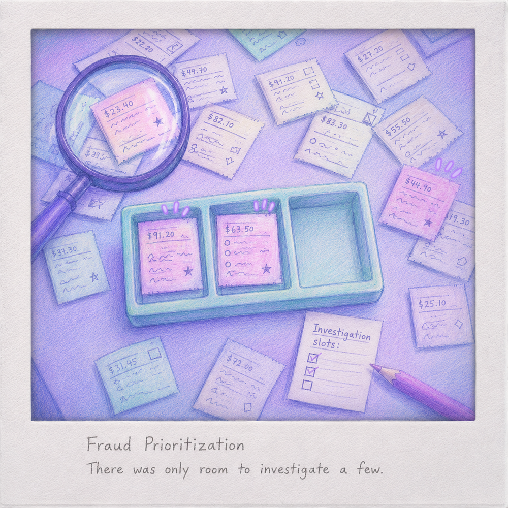
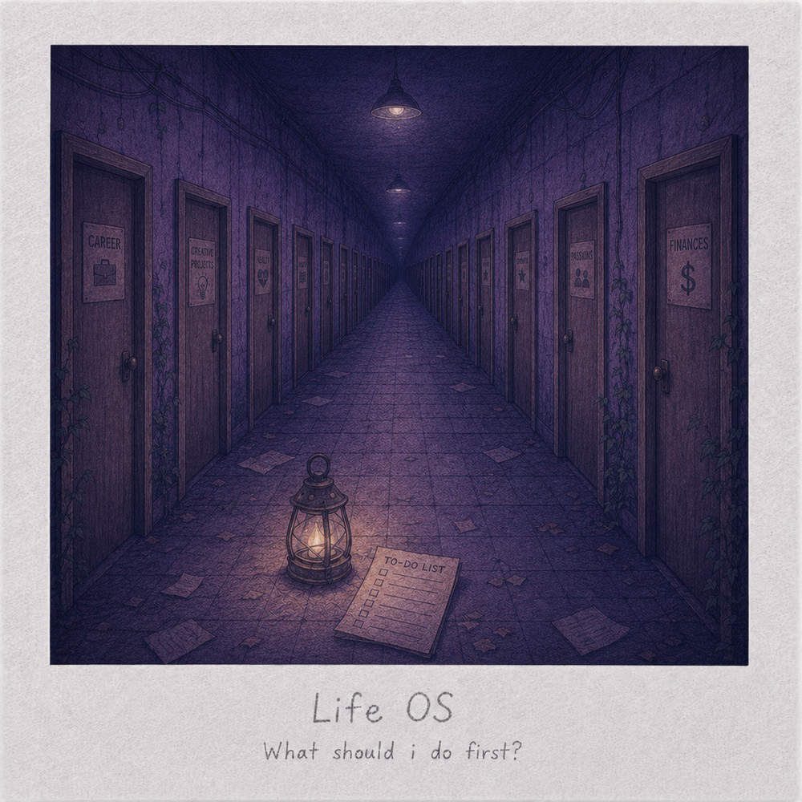
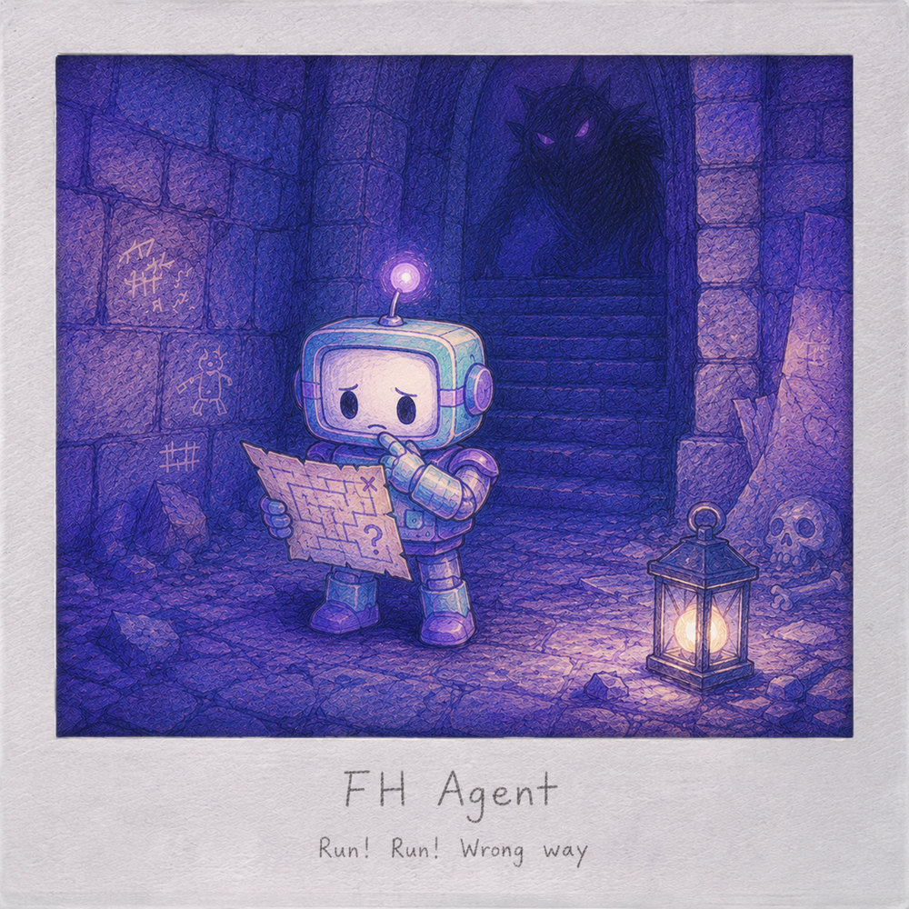
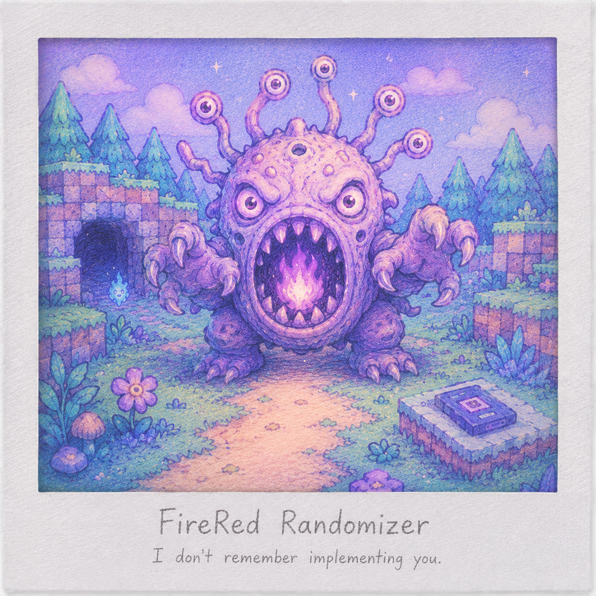

<!--
Version 1 of Planton361's profile README.

The four featured repositories are currently private.
Review every visible project note before publishing the profile.
-->

  

  

  Master's student in Business Informatics and working student in financial IT. 
  Interested in data-driven systems, personal software and experiments that usually grow beyond their original scope.

  <a href="#my-photo-album">PHOTO ALBUM</a>
  &nbsp;&nbsp;·&nbsp;&nbsp;
  <a href="#now">NOW</a>
  &nbsp;&nbsp;·&nbsp;&nbsp;
  <a href="#recent-notes">RECENT NOTES</a>
  &nbsp;&nbsp;·&nbsp;&nbsp;
  <a href="#toolbox">TOOLBOX</a>
  &nbsp;&nbsp;·&nbsp;&nbsp;
  <a href="#open-the-sketchbook">SKETCHBOOK</a>

---

## My Photo Album

<table>
  <tr>
    <td width="50%" align="center">
      
    </td>
    <td width="50%" align="center">
      
    </td>
  </tr>
  <tr>
    <td width="50%" align="center">
      
    </td>
    <td width="50%" align="center">
      
    </td>
  </tr>
</table>

### Fraud Prioritization

A research project on ranking credit-card transactions when investigation capacity is limited.  
The photograph captures the central constraint: many potentially relevant cases, but only a few available review slots.

`Python` · `Learning to Rank` · `Fraud Detection` · `Reproducible Research`

Turn the photo over

#### What this photograph captures

The limited tray represents a fixed investigation budget. The surrounding receipts represent the larger candidate pool, where fraud relevance and potential financial impact do not always point to the same cases.

#### Behind the project

The experimental repository evaluates budget-conditioned ranking approaches for prioritizing transactions. It keeps probability estimation, ranking scores and impact proxies conceptually separate and places strong emphasis on provenance, verification and reproducibility.

**Status:** Active master's thesis project  
**Repository:** Private

---

### Life OS

A personal planning and second-brain web application created to reduce decision overload across study, work and personal projects.  
The corridor represents the moment before the system existed: every door looked important, but none looked like the obvious first step.

`Web Application` · `Personal Planning` · `Second Brain` · `Product Design`

Read the note on the back

#### What this photograph captures

The doors stand for competing obligations, projects and interests. The scene intentionally offers no highlighted solution: it represents the decision paralysis that motivated the application.

#### Behind the project

Life OS brings daily planning, tasks, projects, goals, reviews, education, work, coding, health and personal areas into one controlled system. Its design principle is simple: less interface, more control.

**Status:** Active private project  
**Repository:** Private

---

### FH Agent

An autonomous agent architecture designed to perceive, remember and navigate a difficult RPG without hidden game knowledge.  
The robot is still studying the map while the dungeon has already introduced a more immediate problem.

`Python` · `Agent Architecture` · `Local LLM` · `Safety`

Look closer

#### What this photograph captures

The map represents autonomous planning from incomplete evidence. The creature behind the robot represents the consequences of incorrect perception, delayed decisions and unsafe action.

#### Behind the project

The architecture separates perception, evidence, memory, planning and safe execution. Early milestones deliberately focus on observation, logging, no-spoiler boundaries and controlled actions before adding long-running autonomy or reinforcement learning.

**Status:** Active private experiment  
**Repository:** Private

---

### FireRed Randomizer

A documented workspace for combining a heavily modified FireRed-based game with a modern randomizer and supporting tools.  
The encounter represents a familiar debugging moment: something unexpected appears, and now the implementation has to explain why.

`Java` · `Game Modding` · `Compatibility Engineering` · `Testing`

Turn the last photograph over

#### What this photograph captures

The creature is not a specific game character. It stands for the unexpected combinations, visual regressions and edge cases that appear when old game systems meet expanded data, newer mechanics and randomized rules.

#### Behind the project

The workspace coordinates reproducible builds, tool versions, compatibility work and targeted runtime checks for a FireRed-based Gen 9 setup. The project keeps ROMs and other protected artifacts outside version control.

**Status:** Active private workspace  
**Related public repository:** [Universal Pokémon Randomizer FVX](https://github.com/Planton361/universal-pokemon-randomizer-fvx)

---

## Now

<table>
  <tr>
    <td width="33%" valign="top">
      <strong>Master's thesis</strong>  
      Verification, packaging and the final presentation pipeline.
    </td>
    <td width="33%" valign="top">
      <strong>Life OS</strong>  
      Refining daily planning, rewards and long-term personal structure.
    </td>
    <td width="33%" valign="top">
      <strong>FH Agent</strong>  
      Hardening safe input, dry runs and controlled live execution.
    </td>
  </tr>
</table>

---

## Recent Notes

<!-- RECENT-NOTES:START -->

- **Fraud Prioritization** — Added coverage and packaging gates.
- **Life OS** — Added shop items with atomic redemption.
- **FH Agent** — Hardened single-directional tap smoke validation.
- **FireRed Randomizer** — Approved the 29-slot TM/HM item-ball policy.

<!-- RECENT-NOTES:END -->

Version 1 keeps these notes curated manually. A later workflow can update this block from selected commits.

---

## Toolbox

<table>
  <tr>
    <td width="33%" valign="top">
      <strong>Data and machine learning</strong>  
      Python 
      pandas 
      scikit-learn 
      Jupyter
    </td>
    <td width="33%" valign="top">
      <strong>Software and systems</strong>  
      SQL 
      Java 
      Git and GitHub 
      GitHub Actions
    </td>
    <td width="33%" valign="top">
      <strong>Process and architecture</strong>  
      Camunda and BPMN 
      Agent workflows 
      Testing and validation 
      Documentation-driven development
    </td>
  </tr>
</table>

---

## Open the Sketchbook

Open the sketchbook

### In progress

- Animated profile experiments
- A custom activity visualization
- Better diagrams for research and architecture
- Small agent-memory prototypes

### Not ready for a repository

- Design fragments
- Small utilities
- Ideas that still need a reason to exist

Last updated: July 2026

 

  
    The typing animation is provided by
    <a href="https://github.com/DenverCoder1/readme-typing-svg">Readme Typing SVG</a>.
  

