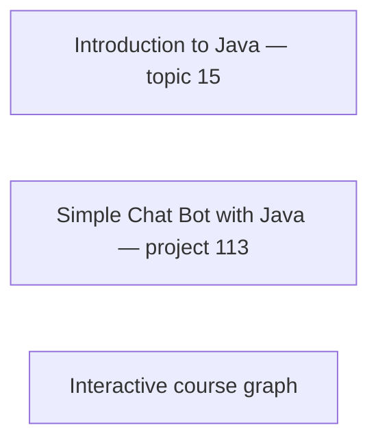

# GitHub Mermaid interaction probe

This separate probe does not assert new knowledge relationships. Nodes are intentionally disconnected.



<details>
<summary>Native disclosure test</summary>

Disclosure works independently of Mermaid. [Normal topic link](https://hyperskill.org/learn/step/38627).

</details>

## Runtime reported by GitHub

```mermaid
info
```
