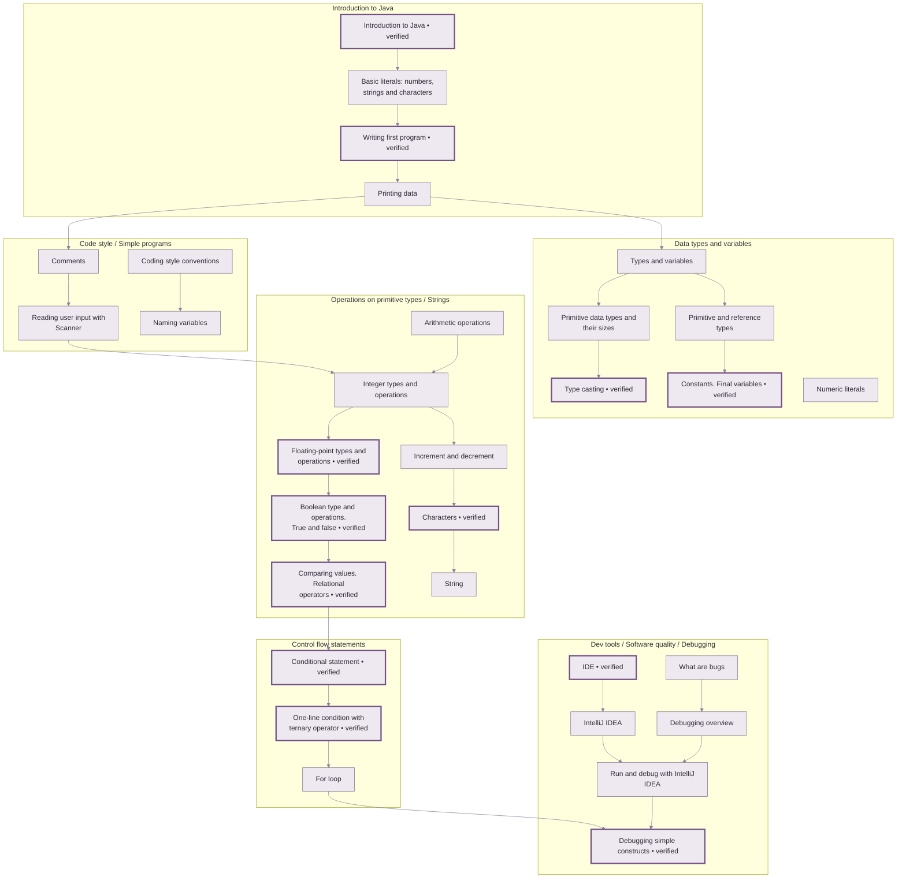
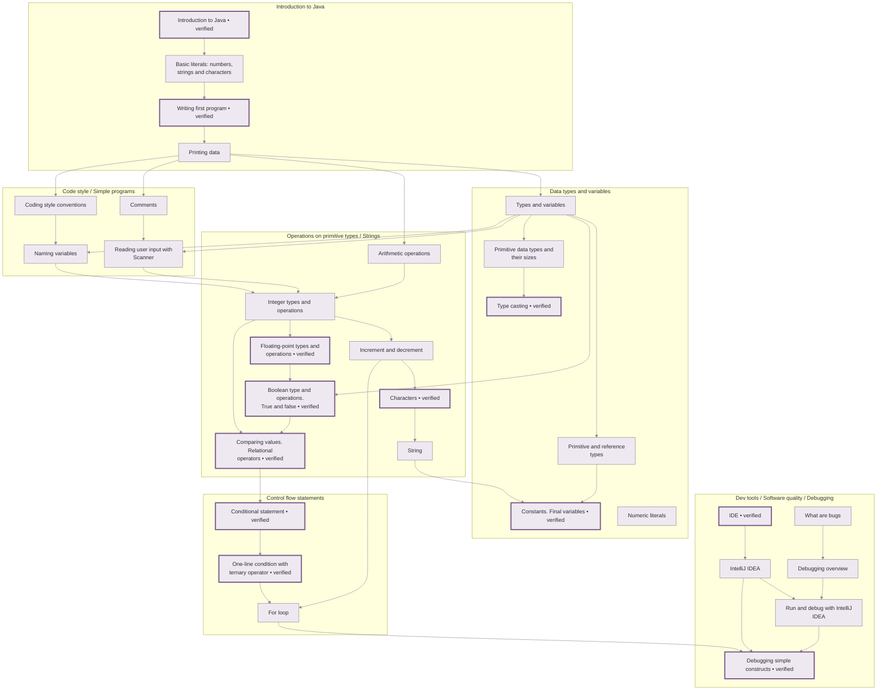

> Isolated GitHub rendering preview. The profile README is unchanged. [A](variant-a.md) · [B](variant-b.md) · [Interaction probe](node-links.md)

## My learning map

The ideas I’ve learned — and how they connect.

**Introduction to Java · 31 learned topics · 12 also verified**



Topic nodes link to Hyperskill (in the same tab on GitHub). All shown topics are explicitly learned. The thicker border and “verified” label add verification; their absence
does not mean missing knowledge. The main graph shows 28 of 38 proven links. Arrows show selected prerequisites, not the
order in which I studied. Display groups combine named Hyperskill categories.

**Built along the way:** [Simple Chat Bot with Java](https://hyperskill.org/projects/113)
— completed. Its 26 required topics are included in this learned set;
requirements are not proof of topic-level application.

[Explore the full interactive course graph](https://planton361.github.io/hyperskill-projects/knowledge-graph/)

<details>
<summary>All 31 topics — IDs, links and verification</summary>

Learned is exclusively `is_learned === true`. Verification is a separate field.

| Topic | Hyperskill ID | Verification |
|---|---:|---|
| [String](https://hyperskill.org/learn/step/3523) | 9 | evaluation |
| [Types and variables](https://hyperskill.org/learn/step/3518) | 14 | evaluation |
| [Introduction to Java](https://hyperskill.org/learn/step/38627) | 15 | verified |
| [Conditional statement](https://hyperskill.org/learn/step/3503) | 25 | verified |
| [Integer types and operations](https://hyperskill.org/learn/step/3565) | 27 | evaluation |
| [Comments](https://hyperskill.org/learn/step/3520) | 30 | evaluation |
| [Characters](https://hyperskill.org/learn/step/3514) | 31 | verified |
| [Type casting](https://hyperskill.org/learn/step/3510) | 32 | verified |
| [Floating-point types and operations](https://hyperskill.org/learn/step/3517) | 36 | verified |
| [Boolean type and operations. True and false](https://hyperskill.org/learn/step/3516) | 87 | verified |
| [Comparing values. Relational operators](https://hyperskill.org/learn/step/3512) | 88 | verified |
| [For loop](https://hyperskill.org/learn/step/3505) | 89 | evaluation |
| [Naming variables](https://hyperskill.org/learn/step/3513) | 112 | evaluation |
| [Reading user input with Scanner](https://hyperskill.org/learn/step/9055) | 113 | failed |
| [Arithmetic operations](https://hyperskill.org/learn/step/3519) | 146 | evaluation |
| [Basic literals: numbers, strings and characters](https://hyperskill.org/learn/step/3522) | 147 | evaluation |
| [Writing first program](https://hyperskill.org/learn/step/3521) | 148 | verified |
| [One-line condition with ternary operator](https://hyperskill.org/learn/step/3506) | 152 | verified |
| [Primitive data types and their sizes](https://hyperskill.org/learn/step/3532) | 161 | evaluation |
| [Printing data](https://hyperskill.org/learn/step/3749) | 193 | evaluation |
| [IDE](https://hyperskill.org/learn/step/10996) | 259 | verified |
| [IntelliJ IDEA](https://hyperskill.org/learn/step/37202) | 260 | evaluation |
| [Increment and decrement](https://hyperskill.org/learn/step/5008) | 307 | evaluation |
| [Numeric literals](https://hyperskill.org/learn/step/10545) | 308 | evaluation |
| [Primitive and reference types](https://hyperskill.org/learn/step/5035) | 309 | evaluation |
| [What are bugs](https://hyperskill.org/learn/step/5504) | 348 | evaluation |
| [Constants. Final variables](https://hyperskill.org/learn/step/7427) | 571 | verified |
| [Coding style conventions](https://hyperskill.org/learn/step/12411) | 1248 | evaluation |
| [Debugging overview](https://hyperskill.org/learn/step/14368) | 1476 | evaluation |
| [Debugging simple constructs](https://hyperskill.org/learn/step/16479) | 1761 | verified |
| [Run and debug with IntelliJ IDEA](https://hyperskill.org/learn/step/37206) | 3538 | evaluation |

Topic 113 is learned even though its assessment status is `failed`.
Topic IDs and project IDs are separate namespaces.

</details>

<details>
<summary>How these topics connect — all 38 prerequisite relationships</summary>

This is the complete learned-topic prerequisite subgraph, not a study timeline.
The duplicate `dependent` evidence is not drawn twice. Topic 308 (Numeric
literals) has no prerequisite connection within this learned subset.
Subgraph titles are display groups, not additional topic entities.



The upper illustration deliberately selects fewer edges for readability.
Topic links remain in the table so navigation does not depend on Mermaid click
support. Spatial proximity alone never claims a prerequisite.

</details>

<details>
<summary>Project evidence and course context</summary>

- Project 113: completed; 26 distinct `project_requires` targets.
- Project 380: active; no completed stages in the recorded snapshot.
- Course progress: **31 / 89 learned**, zero skipped; 58 explicitly not learned.
- Hyperskill Applied counter: **26 / 85**, aggregate only.
- Applied topic IDs: unknown. No `project_applies` relations are asserted.
- Snapshot: 2026-10-01; personal topic status observed at 13:57:59.083 UTC.

Project 113 required-topic IDs:

```text
9, 14, 15, 25, 27, 30, 31, 36, 87, 88, 89, 112, 113, 146, 147, 148, 152, 193, 259, 260, 307, 348, 1248, 1476, 1761, 3538
```

The five learned topics outside that required set are Type casting (32),
Primitive data types and their sizes (161), Numeric literals (308),
Primitive and reference types (309), and Constants. Final variables (571).

</details>
